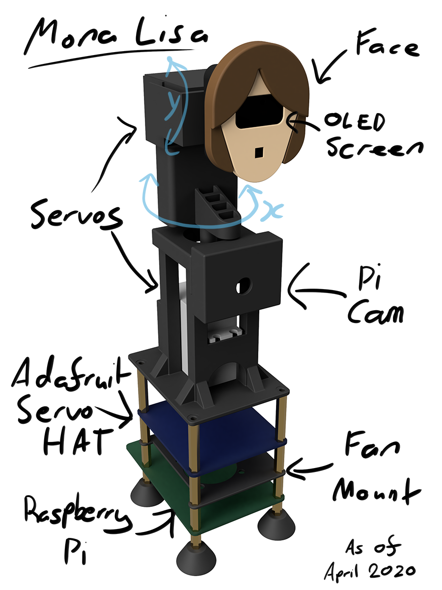

# Mona Lisa

A small home robotics project where the eyes follow you around the room. Initially built in July 2019, but polished off during the COVID-19 Lockdown in March/April 2020.

## Features

* OLED Screen with digital eyes displayed
* 2 servos used in combination to provide 2D range of movement
* [Blessed](https://github.com/chjj/blessed) dashboard displaying face locations, detection time graphs and more.
* Multiple Face Detection implementations using [OpenCV](https://opencv.org/) or [face-api.js](https://github.com/justadudewhohacks/face-api.js/)
* Optional behaviours such as blinking, winking and sleeping.

## Tech Used
### Hardware
* [Raspberry Pi 4 (4GB)](https://www.raspberrypi.org/products/raspberry-pi-4-model-b/specifications/)
* [Adafruit 16-Channel PWM / Servo HAT for Raspberry Pi](https://www.adafruit.com/product/2327)

### Software
* [Node.js](https://nodejs.org/en/)
* [TypeScript](https://www.typescriptlang.org/)
* [RxJS](https://rxjs-dev.firebaseapp.com/)
* [Johnny-Five](http://johnny-five.io/)
* [Raspi IO](https://github.com/nebrius/raspi-io)
* [raspberry-pi-camera-native](https://github.com/sandeepmistry/node-raspberry-pi-camera-native)
* [OpenCV](https://opencv.org/) via [node-opencv](https://github.com/peterbraden/node-opencv) - face detection
* [face-api.js](https://github.com/justadudewhohacks/face-api.js/) - for face detection
* [oled js](https://github.com/noopkat/oled-js)
* [Blessed](https://github.com/chjj/blessed) - dashboard
